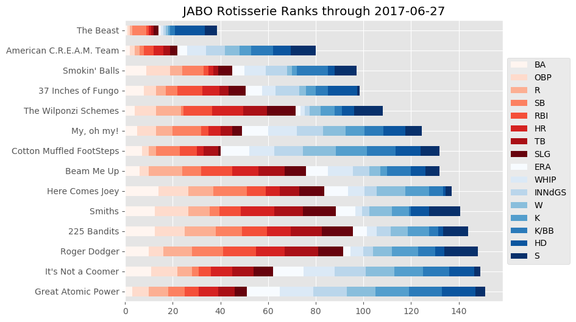

# roto-ranks
Calculates the rotisserie rankings for CBS Sports fantasy baseball leagues. [Here's an example.](http://jgdwyer.com/roto-ranks/index.html)

For fantasy baseball head-to-head leagues on CBS Sports there is no way to view rotosserie rankings. This code makes this calculation by downloading the html page of team statistics for the user's league, scraping to produce a csv file, calculating the rankings, and producing some graphics. I also set up a daily cronjob to run the scripts and transfer the files to AWS.

(In Rotisserie scoring each team is ranked from first to last in each scoring statistic such as home runs, batting average, etc. The rankings are then tallied to give an overall score).

